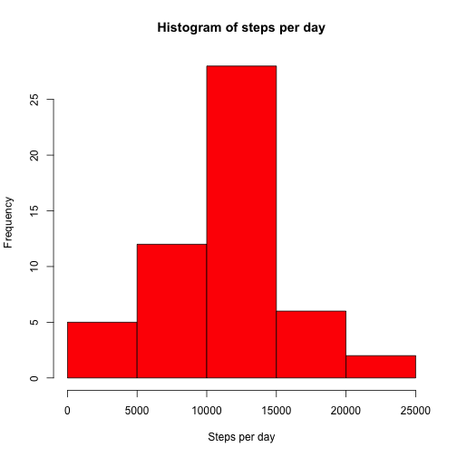
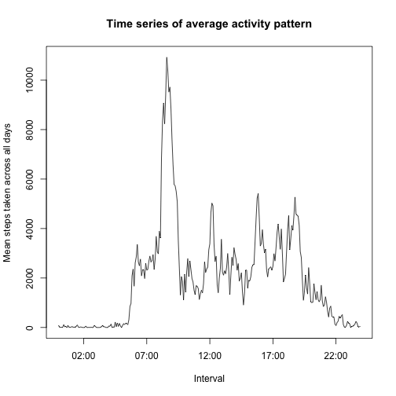
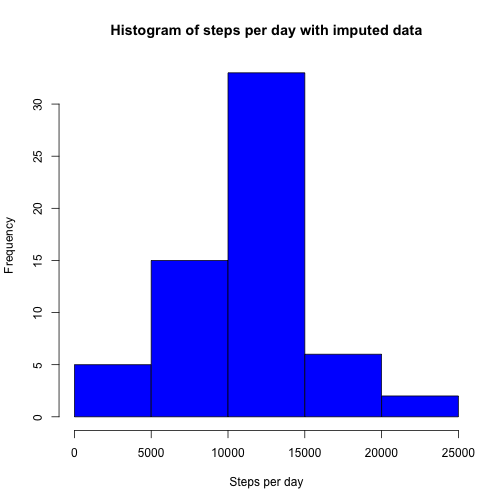
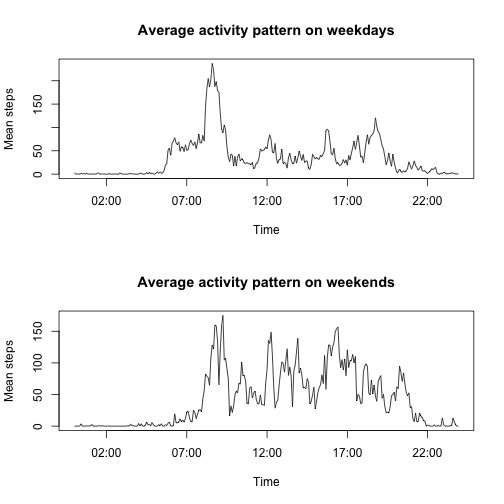

# Reproducible Research: Peer Assessment 1
========================================================

# Introduction

This assignment makes use of data from a personal activity monitoring device. This device collects data at 5 minute intervals through out the day. The data consists of two months of data from an anonymous individual collected during the months of October and November, 2012 and include the number of steps taken in 5 minute intervals each day.

The data for this assignment can be downloaded from the course web site https://d396qusza40orc.cloudfront.net/repdata%2Fdata%2Factivity.zip

The variables included in this dataset are:

- steps: Number of steps taking in a 5-minute interval (missing values are coded as `NA`)

- date: The date on which the measurement was taken in YYYY-MM-DD format

- interval: Identifier for the 5-minute interval in which measurement was taken

The dataset is stored in a comma-separated-value (CSV) file and there are a total of 17,568 observations.

The packages lubridate and dplyr were installed prior to the analysis.

# Loading and preprocessing the data

The file was downloaded, unzipped and read into a data frame.


```r
file <- tempfile()
download.file("http://d396qusza40orc.cloudfront.net/repdata%2Fdata%2Factivity.zip", 
    file)

zipFileInfo <- unzip(file, list = TRUE)
activity <- read.csv(unz(file, as.character(zipFileInfo$Name)), header = TRUE)
unlink(file)
```


The data was transformed into a time variable using the lubridate package.  A variable was also created to identify the day of the week using the weekdays command.


```r
library("lubridate")
activity$time <- parse_date_time(sprintf("%04s", paste(activity$interval)), 
    "hm")
head(activity$time)
```

```
## [1] "0000-01-01 00:00:00 UTC" "0000-01-01 00:05:00 UTC"
## [3] "0000-01-01 00:10:00 UTC" "0000-01-01 00:15:00 UTC"
## [5] "0000-01-01 00:20:00 UTC" "0000-01-01 00:25:00 UTC"
```

```r
activity$dayofweek <- weekdays(as.Date(activity$date))
head(activity$dayofweek)
```

```
## [1] "Monday" "Monday" "Monday" "Monday" "Monday" "Monday"
```


# What is the mean total number of steps taken per day?

Incomplete data were omitted (n=13264 rows) 


```r
totalActivity <- na.omit(activity)
```


Using dplyr package, activity data was grouped by date, and then within each group, we summarise by totaling the number of steps.


```r
library(dplyr)
```

```
## 
## Attaching package: 'dplyr'
## 
## The following objects are masked from 'package:lubridate':
## 
##     intersect, setdiff, union
## 
## The following objects are masked from 'package:stats':
## 
##     filter, lag
## 
## The following objects are masked from 'package:base':
## 
##     intersect, setdiff, setequal, union
```

```r
grouped <- group_by(totalActivity, date)
totalGrouped <- summarise(grouped, totalSteps = sum(steps, na.rm = TRUE))
```


Making the histogram

The histogram is created using the command below.


```r
hist(totalGrouped$totalSteps, xlab = "Steps per day", main = "Histogram of steps per day", 
    col = "red")
```

 


Calculating mean and median

Using the commands below, the mean step is 10766.19 and median step is 10765.


```r
meansteps <- mean(totalGrouped$totalSteps)
mediansteps <- median(totalGrouped$totalSteps)
```


# What is the average daily activity pattern?

Using the dplyr package, the activity data was grouped by interval, and then within each group, summarised by averaging the number of steps.


```r
library(dplyr)
grouped <- group_by(totalActivity, time)
meanGrouped <- summarise(grouped, meanSteps = sum(steps))
head(meanGrouped)
```

```
## Source: local data frame [6 x 2]
## 
##                  time meanSteps
## 1 0000-01-01 00:00:00        91
## 2 0000-01-01 00:05:00        18
## 3 0000-01-01 00:10:00         7
## 4 0000-01-01 00:15:00         8
## 5 0000-01-01 00:20:00         4
## 6 0000-01-01 00:25:00       111
```


Making the time series plot

The time series is created using the command below.


```r
plot(meanSteps ~ time, data = meanGrouped, type = "l", xlab = "Interval", ylab = "Mean steps taken across all days", 
    main = "Time series of average activity pattern")
```

 


Which 5-minute interval, on average across all the days in the dataset, contains the maximum number of steps?

The interval containing the maximum average number of steps is 08:35:00 UTC.


```r
maxinterval <- subset(meanGrouped, meanSteps == max(meanGrouped$meanSteps), 
    select = "time")$time
```


# Imputing missing values

Total number of missing values in the dataset

The total number of rows with missing values is 2304.


```r
incompleteCases = nrow(activity) - sum(complete.cases(activity))
```


Filling NA's with average for that 5-min interval

The strategy used below is to fill in the mising values by the mean for that 5 min interval and the same weekday.  

Creating a new dataset with the missing data filled in.


```r
impute <- group_by(totalActivity, dayofweek, interval)
imputeMean <- as.data.frame(summarise(impute, meansteps = mean(steps)))

imputedActivity <- activity
for (i in 1:nrow(imputedActivity)) {
    if (is.na(imputedActivity$steps[i])) {
        thisdayofweek = imputedActivity$dayofweek[i]
        thisinterval = imputedActivity$interval[i]
        meanval = subset(imputeMean, dayofweek == thisdayofweek & interval == 
            thisinterval, select = "meansteps")
        imputedActivity$steps[i] <- meanval
    }
}
imputedActivity$steps <- as.numeric(imputedActivity$steps)
```


Making the histogram

The histogram of the imputed data is shown using the commands below.


```r
grouped <- group_by(imputedActivity, date)
totalGrouped <- summarise(grouped, totalSteps = sum(steps))
hist(totalGrouped$totalSteps, xlab = "Steps per day", main = "Histogram of steps per day with imputed data", 
    col = "blue")
```

 


Calculating mean and median total number of steps taken per day

Using the commands below, the mean step is 10821.21 and median step is 11015.  These are higher from the calculations made before (prior to imputing data).


```r
meansteps <- mean(totalGrouped$totalSteps)
mediansteps <- median(totalGrouped$totalSteps)
```


# Are there differences in activity patterns between weekdays and weekends?

A new factor variable is created in the dataset with two levels ??? ???weekday??? and ???weekend??? indicating whether a given date is a weekday or weekend day. 


```r
imputedActivity$daytype <- imputedActivity$dayofweek %in% c("Saturday", "Sunday")
imputedActivity$daytype <- factor(imputedActivity$daytype, levels = c(FALSE, 
    TRUE), labels = c("weekday", "weekend"))
```


A panel plot containing time series of the 5-minute interval (x-axis) and the average number of steps taken averaged across all weekdays and weekend days (y-axis) is created using the commands below.


```r
weekdaydata <- subset(imputedActivity, daytype == "weekday")
weekdayInterval <- group_by(weekdaydata, time)
weekdaymean <- summarise(weekdayInterval, meanSteps = mean(steps))
weekenddata <- subset(imputedActivity, daytype == "weekend")
weekendInterval <- group_by(weekenddata, time)
weekendmean <- summarise(weekendInterval, meanSteps = mean(steps))

par(mfrow = c(2, 1))
plot(meanSteps ~ time, data = weekdaymean, type = "l", xlab = "Time", ylab = "Mean steps", 
    main = "Average activity pattern on weekdays")
plot(meanSteps ~ time, data = weekendmean, type = "l", xlab = "Time", ylab = "Mean steps", 
    main = "Average activity pattern on weekends")
```

 

